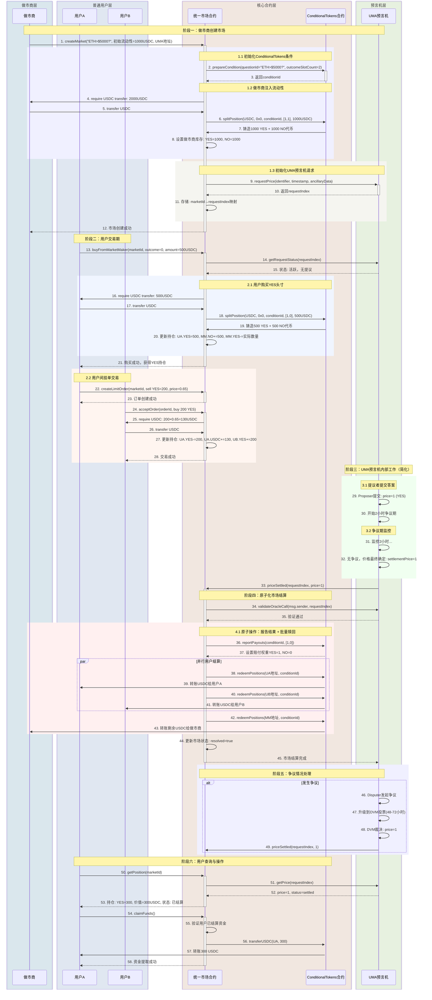

# CTFMARKET

## 调用流程

```mermaid
sequenceDiagram
    box rgba(180, 220, 240, 0.3) 做市商层
    participant MM as 做市商
    end
    
    box rgba(200, 220, 255, 0.3) 普通用户层
    participant UA as 用户A
    participant UB as 用户B
    end
    
    box rgba(255, 220, 200, 0.3) 核心合约层
    participant M as 统一市场合约
    participant CT as ConditionalTokens合约
    end
    
    box rgba(220, 255, 200, 0.3) 预言机层
    participant UMA as UMA预言机
    end

    %% ====== 第一阶段：做市商创建市场 ======
    Note over MM,UMA: 阶段一：做市商创建市场
    MM->>+M: 1. createMarket("ETH>$5000?", 初始流动性=1000USDC, UMA地址)
    
    rect rgb(240, 240, 255)
        Note over M,CT: 1.1 初始化ConditionalTokens条件
        M->>+CT: 2. prepareCondition(questionId="ETH>$5000?", outcomeSlotCount=2)
        CT-->>-M: 3. 返回conditionId
        
        Note over M,CT: 1.2 做市商注入流动性
        M->>MM: 4. require USDC transfer: 2000USDC
        MM->>M: 5. transfer USDC
        M->>CT: 6. splitPosition(USDC, 0x0, conditionId, [1,1], 1000USDC)
        CT->>M: 7. 铸造1000 YES + 1000 NO代币
        M->>M: 8. 设置做市商库存: YES=1000, NO=1000
    end
    
    rect rgb(245, 245, 240)
        Note over M,UMA: 1.3 初始化UMA预言机请求
        M->>+UMA: 9. requestPrice(identifier, timestamp, ancillaryData)
        UMA-->>-M: 10. 返回requestIndex
        M->>M: 11. 存储: marketId→requestIndex映射
    end
    
    M-->>-MM: 12. 市场创建成功

    %% ====== 第二阶段：用户交易 ======
    Note over UA,UB: 阶段二：用户交易期
    UA->>+M: 13. buyFromMarketMaker(marketId, outcome=0, amount=500USDC)
    M->>UMA: 14. getRequestStatus(requestIndex)
    UMA-->>M: 15. 状态: 活跃，无提议
    
    rect rgb(240, 245, 255)
        Note over M,CT: 2.1 用户购买YES头寸
        M->>UA: 16. require USDC transfer: 500USDC
        UA->>M: 17. transfer USDC
        M->>CT: 18. splitPosition(USDC, 0x0, conditionId, [1,0], 500USDC)
        CT->>M: 19. 铸造500 YES + 500 NO代币
        M->>M: 20. 更新持仓: UA.YES=500, MM.NO+=500, MM.YES-=实际数量
    end
    
    M-->>-UA: 21. 购买成功，获得YES持仓
    
    rect rgb(255, 245, 240)
        Note over UA,UB: 2.2 用户间挂单交易
        UA->>+M: 22. createLimitOrder(marketId, sell YES=200, price=0.65)
        M-->>-UA: 23. 订单创建成功
        UB->>+M: 24. acceptOrder(orderId, buy 200 YES)
        M->>UB: 25. require USDC: 200×0.65=130USDC
        UB->>M: 26. transfer USDC
        M->>M: 27. 更新持仓: UA.YES-=200, UA.USDC+=130, UB.YES+=200
        M-->>-UB: 28. 交易成功
    end

    %% ====== 第三阶段：UMA预言机工作 ======
    Note over UMA,UMA: 阶段三：UMA预言机内部工作（简化）
    
    rect rgb(240, 255, 240)
        Note over UMA,UMA: 3.1 提议者提交答案
        UMA->>UMA: 29. Proposer提交: price=1 (YES)
        UMA->>UMA: 30. 开始2小时争议期
        
        Note over UMA,UMA: 3.2 争议期监控
        UMA->>UMA: 31. 监控2小时...
        UMA->>UMA: 32. 无争议，价格最终确定: settlementPrice=1
    end
    
    UMA->>+M: 33. priceSettled(requestIndex, price=1)

    %% ====== 第四阶段：市场结算 ======
    Note over M,CT: 阶段四：原子化市场结算
    M->>UMA: 34. validateOracleCall(msg.sender, requestIndex)
    UMA-->>M: 35. 验证通过
    
    rect rgb(255, 240, 240)
        Note over M,CT: 4.1 原子操作：报告结果 + 批量赎回
        M->>+CT: 36. reportPayouts(conditionId, [1,0])
        CT-->>M: 37. 设置赔付权重YES=1, NO=0
        
        par 并行用户结算
            M->>CT: 38. redeemPositions(UA地址, conditionId)
            CT->>UA: 39. 转账USDC给用户A
            M->>CT: 40. redeemPositions(UB地址, conditionId)
            CT->>UB: 41. 转账USDC给用户B
        end
        
        M->>CT: 42. redeemPositions(MM地址, conditionId)
        CT->>MM: 43. 转账剩余USDC给做市商
    end
    
    M->>M: 44. 更新市场状态: resolved=true
    M-->>-UMA: 45. 市场结算完成

    %% ====== 第五阶段：争议处理（替代路径） ======
    rect rgb(240, 240, 255)
        Note over UMA,M: 阶段五：争议情况处理
        alt 发生争议
            UMA->>UMA: 46. Disputer发起争议
            UMA->>UMA: 47. 升级到DVM投票(48-72小时)
            UMA->>UMA: 48. DVM裁决: price=1
            UMA->>M: 49. priceSettled(requestIndex, 1)
        end
    end

    %% ====== 第六阶段：用户操作 ======
    Note over UA,CT: 阶段六：用户查询与操作
    UA->>+M: 50. getPosition(marketId)
    M->>UMA: 51. getPrice(requestIndex)
    UMA-->>M: 52. price=1, status=settled
    M-->>-UA: 53. 持仓: YES=300, 价值=300USDC, 状态: 已结算
    
    UA->>+M: 54. claimFunds()
    M->>M: 55. 验证用户已结算资金
    M->>CT: 56. transferUSDC(UA, 300)
    CT->>UA: 57. 转账300 USDC
    M-->>-UA: 58. 资金提取成功
```

## 术语表

CT----[ConditionalTokens](./docs/ConditionalTokens.md)
