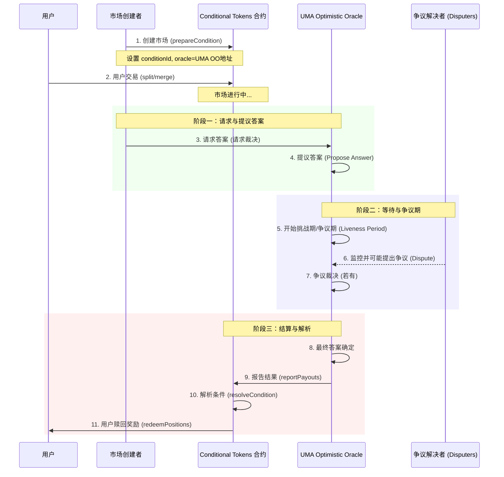

CTFMARKET

```mermaid
sequenceDiagram
    participant U as 用户
    participant M as 市场创建者
    participant CT as Conditional Tokens 合约
    participant OO as UMA Optimistic Oracle
    participant D as 争议解决者 (Disputers)

    M->>CT: 1. 创建市场 (prepareCondition)
    Note over M,CT: 设置 conditionId, oracle=UMA OO地址
    U->>CT: 2. 用户交易 (split/merge)
    Note over CT: 市场进行中...

    rect rgb(240, 255, 240)
        Note over M,OO: 阶段一：请求与提议答案
        M->>OO: 3. 请求答案 (请求裁决)
        OO->>OO: 4. 提议答案 (Propose Answer)
    end

    rect rgb(240, 240, 255)
        Note over OO,D: 阶段二：等待与争议期
        OO->>OO: 5. 开始挑战期/争议期 (Liveness Period)
        D-->>OO: 6. 监控并可能提出争议 (Dispute)
        OO->>OO: 7. 争议裁决 (若有)
    end

    rect rgb(255, 240, 240)
        Note over OO,CT: 阶段三：结算与解析
        OO->>OO: 8. 最终答案确定
        OO->>CT: 9. 报告结果 (reportPayouts)
        CT->>CT: 10. 解析条件 (resolveCondition)
        CT->>U: 11. 用户赎回奖励 (redeemPositions)
    end
```