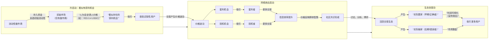

# 经济模型解析

```mermaid
flowchart LR
    subgraph S1[冷启动：看似有获利机会]
        direction TB
        LM[流动性做市商] --> |存入资金<br>创造初始流动性| M[初始市场<br>（仅有做市商）]
        M --> |“人为设定诱人价格<br>（如：YES 0.4 USDC）”| OP[“看似存在的<br>‘获利机会’”]
        OP --> |吸引| FU[首批试探性用户]
    end
    
    S1 --> S2
    
    subgraph S2[网络效应启动]
        direction TB
        FU --> |交易产生价格波动| PV[价格波动]
        PV --> CA[套利机会]
        PV --> SM[投机机会]
        CA --> |吸引| AU[套利者]
        SM --> |吸引| SP[投机者]
        AU & SP --> |更多交易| IE[信息效率提升]
        IE --> |价格反映群体智慧| CM[社区共识形成]
    end
    
    S2 --> S3
    
    subgraph S3[生态自驱动]
        CM --> |讨论、分析、博弈| EC[活跃交易生态]
        EC --> |产生| WIN[“实际赢家（早期/正确者）”]
        EC --> |产生| LOSE[“实际输家（后期/错误者）”]
        WIN --> |“利润可视化<br>（宣传效应）”| MA[吸引更多用户]
        LOSE --> |“寻求翻盘”| MA
    end
```
